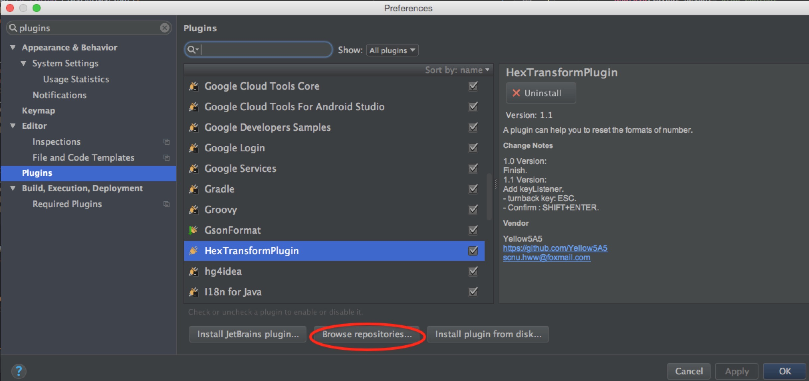
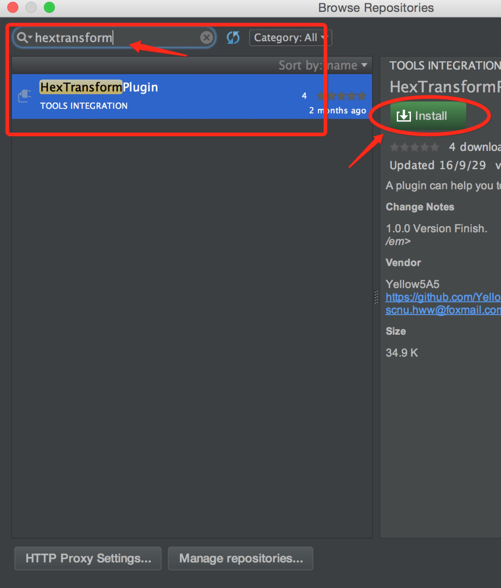
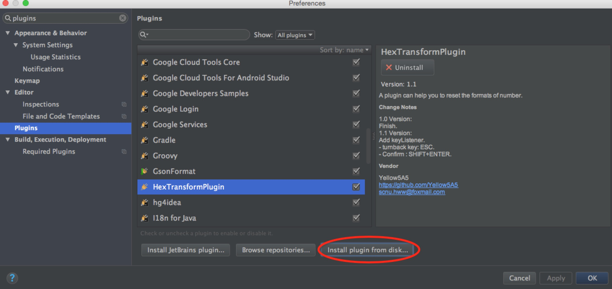
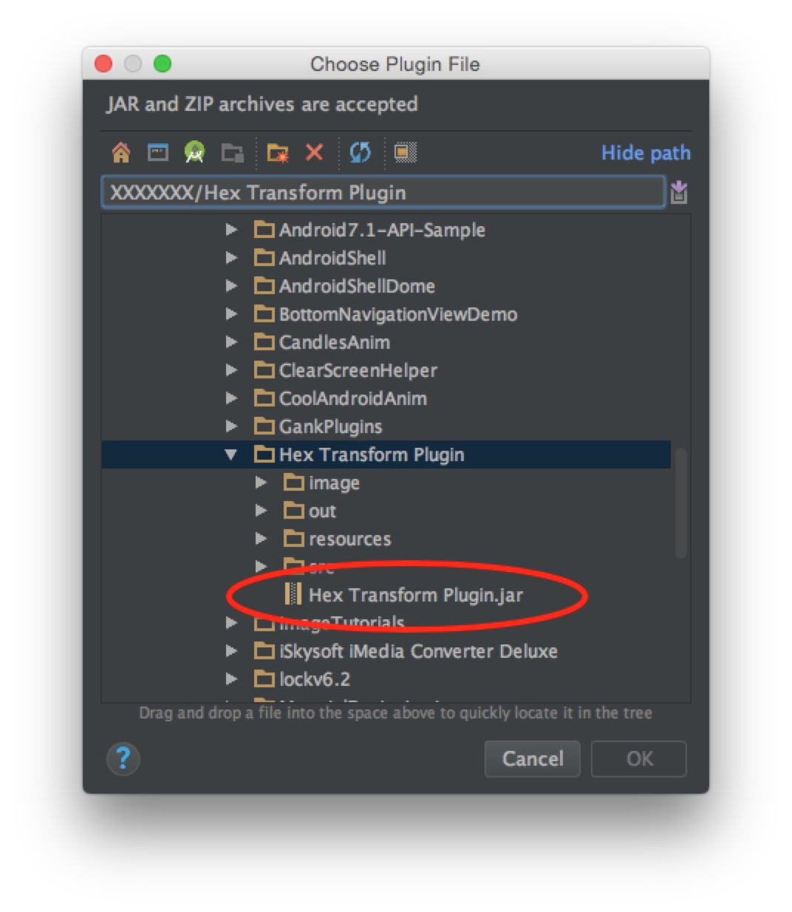
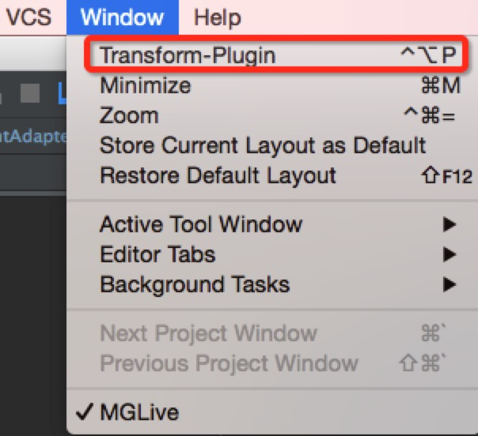
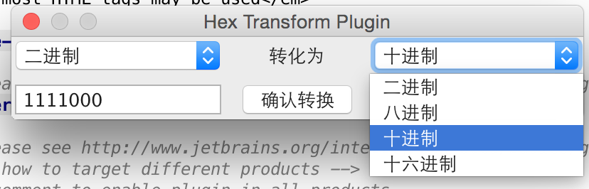
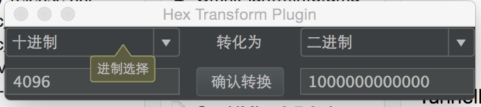

# Hex-Transform-Plugin
The simple plugin can help you to reset the formats of number.

## Install

### From net：

Get plugins from internet.

</img>

Input the plugin name and click the install-btn.

</img>

### From disk:

install plugin from disk.

</img>

find the path of jar.([You can get it here](./Hex Transform Plugin.jar))

</img>

## Usage

</img>

</img>

</img>

Shortcuts: 

- Show the windows of plugin: **Control+Opt+P**

- Confirm to Change: **SHIFT+Enter**

## License

    Copyright 2016 Yellow5A5
    
    Licensed under the Apache License, Version 2.0 (the "License");
    you may not use this file except in compliance with the License.
    You may obtain a copy of the License at
    
        http://www.apache.org/licenses/LICENSE-2.0
    
    Unless required by applicable law or agreed to in writing, software
    distributed under the License is distributed on an "AS IS" BASIS,
    WITHOUT WARRANTIES OR CONDITIONS OF ANY KIND, either express or implied.
    See the License for the specific language governing permissions and
    limitations under the License.
 
